# Building an FP8 Systolic Array NPU on the KR260 with PyTorch/XLA
### Complete Stack Reference — Architecture, Responsibilities & Implementation Guide

---



---

## Overview

This document covers the complete software-to-silicon stack for deploying a 32×32 FP8 systolic array NPU on the AMD Kria KR260 (Zynq UltraScale+ MPSoC), interfaced with PyTorch via PyTorch/XLA and the PJRT plugin API. The KR260 is built on the Zynq UltraScale+ MPSoC EV architecture paired with 4 GB of DDR4 memory, making it a capable platform for edge inference acceleration.

The stack has two fundamentally different parts. Layers 1–4 (Python to PJRT compile) are a **one-time cost** per model — they run on the ARM CPU and produce a cached compiled binary. Layers 5–10 (PJRT execute through hardware) are the **hot path** hit on every inference call. All optimisation effort should focus on minimising DDR bandwidth in the hot path, maximising systolic array utilisation per tile, and overlapping DMA transfers with computation.

---

## The Full Compilation Pipeline at a Glance

```
PyTorch Model
    ↓  torch.compile(backend="openxla") — TorchDynamo intercepts Python bytecode
TorchFX Graph  (ATen ops)
    ↓  PyTorch/XLA LazyTensor bridge
XLA IR  →  StableHLO protobuf
    ↓  XLA target-independent passes (fusion, CSE, buffer alloc)
Optimised HLO protobuf
    ↓  YOUR PJRT plugin compiler
NPU ISA binary  +  FP8 tile-packed weights
    ↓  YOUR PJRT plugin runtime  →  Linux UIO driver
AXI-Lite control registers  +  AXI DMA
    ↓  AXI HP0/HP1 FPD ports (128-bit, 300 MHz)
Systolic Array  →  VPU  →  Accumulator Buffer
    ↓  AXI DMA S2MM
Result tensor in DDR  →  returned to PyTorch
```

---

## Layer 1 — PyTorch / TorchDynamo

### What the tool handles

Everything in this layer is upstream PyTorch. When the user calls `torch.compile(model, backend="openxla")`, TorchDynamo intercepts Python bytecode execution at the interpreter level using hooks. Rather than letting PyTorch run operations eagerly op-by-op, Dynamo identifies "graph breaks" (dynamic control flow it cannot statically analyse) and extracts everything it can compile into a **TorchFX graph** — a Python-level DAG of ATen operators.

Dynamo traces on the first call and caches the result. On every subsequent call it replays the compiled binary directly, skipping graph tracing entirely. This makes the per-call overhead for a deployed inference server negligible after the first warm-up call.

A TorchFX graph looks like:

```
graph():
    %x      = placeholder[target=x]
    %weight = placeholder[target=weight]
    %mm     = call_function[target=torch.ops.aten.mm.default](args=(%x, %weight))
    %relu   = call_function[target=torch.ops.aten.relu.default](args=(%mm,))
    return relu
```

This graph is what gets handed to your PJRT backend compiler downstream.

### What you configure

Nothing in this layer. However, your PJRT plugin must be registered before `torch.compile` is called, because that is how PyTorch/XLA discovers your hardware device.

### What you must not forget

Dynamic shapes (variable batch sizes, variable sequence lengths) can cause Dynamo to retrace. For a fixed-function embedded inference device like the KR260, always run with a fixed input shape. This eliminates retrace events and ensures your compiled NPU binary is always valid.

---

## Layer 2 — PyTorch/XLA LazyTensor Bridge

### What the tool handles

The `torch_xla` C++ library implements the PyTorch `DispatchKey::XLA` dispatch key. Every ATen op executed on an XLA-device tensor is routed to this layer instead of the CPU or CUDA backend. Rather than executing immediately, operations are recorded into an XLA IR graph — this is **lazy evaluation**.

When `torch_xla.sync()` is called (either explicitly or triggered automatically by `torch.compile` on execution), the accumulated IR graph is lowered to HLO (High-Level Opcodes) and dispatched to your PJRT plugin for compilation and execution. This lazy approach allows XLA to see the full computation graph before committing to execution, enabling optimisations that per-op eager execution cannot perform.

### What you configure

Install `torch_xla` as a Python package. Register your PJRT plugin's `.so` file so the XLA device routes to your hardware. You do this either via:

```bash
export PJRT_DEVICE=NPU
export PJRT_LIBRARY_PATH=/path/to/your_npu_plugin.so
```

or via Python package entry points in your plugin's `setup.py`:

```python
entry_points={"torch_xla.plugins": ["npu = my_npu_plugin:NpuPlugin"]}
```

### What you must not forget

`torch_xla.sync()` is the synchronisation barrier that flushes the lazy graph to the backend. In `torch.compile` + `openxla` mode this fires automatically. If you write raw `torch_xla` code for debugging, forgetting this means nothing executes on your NPU.

---

## Layer 3 — XLA Compiler (StableHLO → Optimised HLO)

### What the tool handles

XLA performs a series of target-independent optimisation and analysis passes on the computation graph before your backend ever sees it:

- **Common Subexpression Elimination (CSE):** Identical computations appearing multiple times in the graph are computed once and reused.
- **Op Fusion:** The most important optimisation. XLA groups multiple operations into a single fused kernel. A `dot` followed immediately by a `relu` may arrive at your backend as a single fused HLO node — meaning your compiler can map it to a GEMM + fused VPU activation without a round-trip to DDR between them.
- **Constant Folding:** Computations whose inputs are all constants are evaluated at compile time.
- **Dead Code Elimination:** Operations whose outputs are never used are removed.
- **Buffer Lifetime Analysis:** XLA tracks which tensor buffers can share the same DDR memory region because their live ranges do not overlap. Your compiler receives this aliasing information alongside the HLO graph.
- **Shape Inference:** All tensor shapes throughout the computation are statically known and annotated on every HLO instruction.

StableHLO is the portability layer between PyTorch/XLA and your backend. It is an MLIR dialect representing the model as a graph of ~100 well-defined tensor operations with static shapes. An example of a linear layer in StableHLO:

```mlir
func.func @main(%arg0: tensor<1x512xf8E4M3FNUZ>, %arg1: tensor<512x256xf8E4M3FNUZ>)
    -> tensor<1x256xf32> {
  %0 = stablehlo.dot_general %arg0, %arg1,
      contracting_dims = [1] x [0]
      : (tensor<1x512xf8E4M3FNUZ>, tensor<512x256xf8E4M3FNUZ>) -> tensor<1x256xf32>
  return %0 : tensor<1x256xf32>
}
```

### What you configure

Link your PJRT plugin C++ code against `libxla` and `libstablehlo`. Use XLA's `HloModule`, `HloComputation`, and `HloInstruction` C++ APIs to walk the graph your backend receives. For debugging, dump the pre- and post-optimisation HLO:

```bash
XLA_FLAGS="--xla_dump_to=/tmp/hlo_dump" python your_model.py
```

### What you must not forget

Respect XLA's buffer alias information. If XLA indicates that two tensors can share the same DDR region (because their lifetimes don't overlap), honour that assignment. On the KR260 with a shared 4 GB DDR pool between PS and PL, unnecessary duplication wastes memory and kills cache efficiency.

---

## Layer 4a — PJRT Plugin: Compiler  (HLO → NPU ISA)

### What the tool handles

The OpenXLA PJRT C API headers define the function signatures you must implement. The XLA C++ library provides HLO graph walking APIs. That is all the tooling gives you. The translation logic — the actual compilation from HLO to your NPU's binary instruction stream — is entirely your code.

### What you build

A C++ pass implementing `PJRT_Client_Compile`. It receives the optimised HLO graph as a serialised protobuf and must emit your NPU ISA binary. The pass must:

**Op classification:** Walk each `HloInstruction` and classify it:

| HLO opcode | Maps to |
|---|---|
| `kDot` | Tiled `GEMM` instruction(s) |
| `kConvolution` | Tiled `CONV` instruction(s) |
| `kRelu`, `kMaximum`, `kAdd` (elementwise) | `VEC_OP` or fused post-op flag on preceding GEMM |
| `kReduceWindow`, `kGather`, `kSort` | `CPU_FALLBACK` — run on ARM |
| `kBroadcast`, `kReshape`, `kTranspose` | Layout fixups before next tile load |

**GEMM tiling:** For a `dot` of shape `[M×K] × [K×N]`, decompose to `ceil(M/32) × ceil(N/32) × ceil(K/32)` tile iterations. Each tile emits:

```
LOAD_WEIGHTS  <weight_tile_ddr_addr> <32×32 bytes>
LOAD_ACT      <act_tile_ddr_addr>    <32×32 bytes>
GEMM          <tile_M> <tile_N> <tile_K> <acc_buf_addr>
VEC_OP        <post_op_type> <acc_buf_addr>   (if fused activation)
STORE_OUT     <out_ddr_addr> <32×32×4 bytes>  (FP32 output)
```

**FP8 weight packing:** Weights stored row-major in PyTorch must be re-ordered to tile-major layout — each 32×32 tile stored contiguously in DDR. This is a one-time offline transformation done at compile time, not on the hot path.

**Edge tile zero-padding:** If the weight matrix dimensions are not multiples of 32, edge tiles must have the out-of-bounds elements zeroed. A 100×100 matrix on a 32×32 array: the rightmost tile column covers columns 96–99. Columns 4–31 of those tiles must be explicitly set to zero-valued FP8, or your PEs accumulate uninitialised BRAM content.

**CPU fallback splitting:** At boundaries where your NPU cannot handle an op, emit a `CPU_FALLBACK` marker. Your runtime will copy the buffer back to ARM, invoke XLA's CPU backend for that subgraph, then copy back to DDR. Keep fallbacks rare — each one incurs a full DDR round-trip.

### What you configure

- **Tile size:** 32×32 (physical array size, or virtualised over 16×16 in 4 passes if resource-constrained)
- **FP8 format:** E4M3 (range-optimised, better for inference weights — max 448.0; used by NVIDIA H100 and AMD MI300X)
- **Accumulator dtype:** FP32 (mandatory — FP8 accumulators overflow almost immediately in real models)

---

## Layer 4b — PJRT Plugin: Runtime  (Execute + Buffer Management)

### What the tool handles

Nothing beyond the C API function signature. The mechanics — talking to Linux, managing cache coherency, controlling DMA — are entirely your C++ code.

### What you build

A C++ class implementing `PJRT_Executable_Execute`, called on every inference. The exact sequence per inference:

1. Call `ioctl(fd, SYNC_FOR_DEVICE, &buf)` on your UIO driver to flush the CPU cache on the input activation buffer. Without this the DMA reads stale cached data.
2. Copy the pre-compiled instruction binary to the command BRAM region via memory-mapped AXI-Lite writes (or via a second DMA channel if the instruction buffer is large).
3. Write the weight DDR address, activation DDR address, output DDR address, and tile dimensions to your NPU's AXI-Lite control registers.
4. Write `1` to `CTRL[0]` (start bit) to kick the NPU sequencer.
5. Either spin-poll `STATUS[0]` in a tight loop, or block on `read(uio_fd)` waiting for the interrupt.
6. Call `ioctl(fd, SYNC_FOR_CPU, &buf)` to invalidate the CPU cache on the output buffer.
7. Wrap the output DDR region as a PJRT buffer and return it to PyTorch.

### What you configure

**Polling vs. interrupt mode.** Polling delivers ~1 µs wake-up latency but burns CPU cycles. Interrupt mode frees the ARM CPU during NPU execution but introduces ~10–50 µs Linux interrupt latency on a loaded system. For a dedicated inference appliance on KR260, polling is usually the right choice for lowest latency. Make it a runtime flag so you can switch during development.

### What you must not forget

The cache coherency calls at **every** DMA boundary. The Zynq UltraScale+ MPSoC is software-coherent by default when using the HP ports — the CPU software must manually flush and invalidate caches. Miss one flush and your NPU reads stale cached data and produces silently wrong outputs with no hardware error signal.

---

## Layer 5 — Linux Kernel Driver

### What the tool handles

AMD/Xilinx ships `xilinx-dma.ko`, the kernel driver for the AXI DMA IP, enabled by default in PetaLinux projects and available in the Ubuntu kernel for ZynqMP. This driver handles the low-level AXI DMA register programming from kernel space. You do not write DMA engine logic.

### What you build

**UIO kernel module (~250 lines C)** with three responsibilities:

1. **Register mmap region:** Exposes your NPU's physical AXI-Lite register range to userspace via `/dev/uio0`, allowing your PJRT runtime to `mmap` it safely without raw `/dev/mem` access.

2. **DMA buffer allocation:** Calls `dma_alloc_coherent()` to allocate a physically-contiguous, non-cached buffer for activation and output tensor DMA transfers. Non-cached is essential — this prevents the CPU from caching DMA-destination memory, eliminating the need for explicit cache flushes on the output side.

3. **Interrupt handler:** Handles the NPU's done interrupt by calling `wake_up_interruptible()` to unblock any `read()` call from your PJRT runtime.

**Device tree overlay (.dtso, ~30 lines)** describing your NPU IP to Linux:

```dts
&fpga_full {
    #address-cells = <2>;
    #size-cells = <2>;
    npu@a0000000 {
        compatible = "my-npu,1.0";
        reg = <0x0 0xa0000000 0x0 0x10000>;
        interrupt-parent = <&gic>;
        interrupts = <0 89 4>;
        dma-coherent;
    };
};
```

Load at runtime alongside your bitstream:

```bash
fpgautil -b npu_design.bin -o npu_overlay.dtbo
```

### What you configure

- Physical address and size of your NPU's AXI-Lite register space (set in Vivado's address editor, referenced in `.dtso`)
- DMA-coherent buffer size: allocate 4–8 MB to handle large activation tiles and double-buffering overhead
- Interrupt number: assigned in your Vivado block design, referenced in `.dtso`

### What you must not forget

The `reserved-memory` node in the device tree. Linux's memory allocator cannot always satisfy large contiguous physical allocations after the system has been running (memory fragmentation). For weight buffers that may be tens of MB (e.g., a ResNet-50's ~25 MB of FP8 weights), reserve a fixed physical DDR region at boot time:

```dts
reserved-memory {
    #address-cells = <2>;
    #size-cells = <2>;
    ranges;
    npu_weights: npu-weights@70000000 {
        reg = <0x0 0x70000000 0x0 0x10000000>; /* 256 MB */
        no-map;
    };
};
```

---

## Layer 6 — AXI Interconnect (PS ↔ PL)

### What the tool handles

Vivado ships all IP blocks you need as pre-validated, timing-closed cores:

- **Zynq UltraScale+ MPSoC PS block** — includes the quad-core ARM Cortex-A53, DDR controller, HP ports, GP ports, interrupt controller
- **AXI DMA v7.1** — handles all burst transaction logic, AXI4 protocol compliance, scatter-gather (if enabled)
- **AXI Interconnect** — routes multiple AXI masters and slaves
- **AXI4-Stream Data FIFO** — buffers stream data between clock domains or when your NPU exerts backpressure
- **AXI Interrupt Controller** — aggregates multiple interrupt sources for the PS

### What you configure

**PS block:**
- Enable `S_AXI_HP0_FPD` and `S_AXI_HP1_FPD` at 128-bit width — these connect directly to the DDR memory subsystem, bypassing the cache coherent interconnect, providing maximum bandwidth for DMA transfers
- Enable `M_AXI_GP0` — used by the ARM CPU to access your NPU's AXI-Lite control registers

**AXI DMA:**
- Data width: 128 bits (matches HP port width for maximum efficiency)
- Disable scatter-gather for simplicity (simple DMA mode is sufficient for contiguous tile transfers)
- Buffer length register width: ≥26 bits (supports transfers up to 64 MB per transaction)
- Enable both MM2S (memory-mapped to stream — DDR → NPU activations and weights) and S2MM (stream to memory-mapped — NPU output → DDR) channels

**Address map (Vivado address editor):**
- Assign NPU's AXI-Lite slave to a fixed address, e.g. `0xA000_0000`, 64 KB size
- This address is what your UIO driver's `reg` property and your PJRT runtime's `mmap` call reference

**Block design connections:**

```
ARM PS M_AXI_GP0  →  AXI Interconnect  →  AXI DMA AXI-Lite slave
                                        →  NPU AXI-Lite slave

AXI DMA M_AXI_MM2S  →  S_AXI_HP0_FPD  (reads from DDR)
AXI DMA M_AXIS_MM2S →  NPU AXI4-Stream slave

NPU AXI4-Stream master  →  AXI DMA S_AXIS_S2MM
AXI DMA M_AXI_S2MM      →  S_AXI_HP1_FPD  (writes to DDR)

AXI DMA mm2s_introut  →  AXI Interrupt Controller
AXI DMA s2mm_introut  →  AXI Interrupt Controller
AXI Interrupt Controller irq  →  ARM PS pl_ps_irq0
```

### What you must not forget

**Connect the interrupts.** Both `mm2s_introut` and `s2mm_introut` from the AXI DMA must be connected to the PS interrupt controller input. If you skip this, your kernel driver's interrupt handler never fires, and your PJRT runtime blocks indefinitely waiting for a completion signal.

**TLAST assertion.** Your NPU's AXI4-Stream master output must assert `TLAST` on the final data beat of each output tile transfer. The AXI DMA S2MM channel uses `TLAST` to detect end-of-packet and fire the S2MM completion interrupt. If `TLAST` is tied low or asserted on the wrong beat, the DMA stalls permanently.

---

## Layer 7 — NPU Hardware (FPGA PL Fabric)

### What the tool handles

Vivado synthesises your RTL and maps it automatically to the K26's physical resources — DSP48E2 blocks for your multipliers and accumulators, BRAM36 tiles for your weight and activation buffers, and LUT/FF fabric for your control logic. It performs place-and-route to meet the timing constraint you specify in your XDC file. The DSP48E2 comprises a 27-bit pre-adder, a 27×18-bit multiplier, and a 48-bit accumulator — well-suited for packing FP8 integer MAC operations.

### What you build

Every RTL module from scratch, in Verilog or VHDL:

#### Processing Element (PE)

The atomic compute unit. Each PE in a weight-stationary array:
- Holds one stationary FP8 weight in a register (loaded once per tile, held for the whole tile computation)
- Accepts one FP8 activation from the west (from the previous PE in the row or from the skew buffer)
- Passes the activation east to the next PE (registered, one cycle delay)
- Computes FP8 × FP8 → FP32 partial product using DSP48E2's integer multiply path with LUT-based exponent arithmetic
- Accumulates partial products into a FP32 running sum (using the DSP48E2's 48-bit P output)
- Accepts FP32 partial sum from the north (from the PE in the row above)
- Passes FP32 partial sum south to the next PE (registered, one cycle delay)

FP8 on DSP48E2 is not native — the recommended approach is **block floating point**: decompose FP8 → sign + exponent + mantissa, do integer mantissa multiply in the DSP, add exponents in LUTs, renormalise. Alternatively, pre-scale weights to fixed-point per tile (dequantise at the tile boundary) and run pure INT8 MACs, which maps perfectly to the DSP48E2's 8-bit SIMD packing.

#### Systolic Array Controller

Controls the diagonal wavefront data injection:

- **Skew buffers:** A shift register chain per row. Row 0: no delay. Row 1: 1 cycle. Row 2: 2 cycles. Row N-1: N-1 cycles. These stagger the activation inputs so that element `[i,k]` reaches PE `[i,j]` at the same cycle as `weight[i,j]` and `partial_sum[i-1,j]` from the previous row.
- **State machine:** `IDLE → LOAD_WEIGHTS → ACTIVE → DRAINING → DONE`
  - `LOAD_WEIGHTS`: drives a parallel weight bus into all PEs simultaneously (or serial scan chain for smaller arrays)
  - `ACTIVE`: asserts row valid signals and feeds skewed activation rows from the Activation Buffer at one row per cycle
  - `DRAINING`: waits for the pipeline to flush — a 32×32 array with K=32 takes 32 + 32 - 1 = 63 cycles to fully drain
  - `DONE`: raises the completion flag to the Instruction Sequencer

#### On-Chip SRAM Buffers

Three separate banks to prevent read/write conflicts and enable double-buffering:

| Buffer | Implementation | Size | Access pattern |
|---|---|---|---|
| Weight Buffer | Dual-port BRAM36 | 256 KB | Port A: DMA writes; Port B: column-wise reads by array controller |
| Activation Buffer | Double-buffered BRAM36 | 128 KB × 2 | Bank 0: DMA writes tile N+1; Bank 1: array reads tile N; flip on completion |
| Accumulator Buffer | Wide BRAM36 | 64 KB FP32 | Written by array south drain; read by VPU and output DMA |

The double-buffered activation buffer is the key to hiding DDR latency: while the systolic array computes tile N from bank 1, the DMA pre-fetches tile N+1 into bank 0. When tile N finishes, banks flip. This overlaps compute and memory, approaching the theoretical peak throughput.

#### Vector Processing Unit (VPU)

Handles every operation that is not GEMM:

- **ReLU:** Compare accumulator value against zero, clamp. Combinatorial, zero latency.
- **ReLU6:** Clamp between 0 and 6.0. Two comparators.
- **GELU approximation:** Piecewise linear approximation stored in a 1K-entry BRAM lookup table indexed by the FP32 value's upper bits. Accurate to ~0.5% for typical activation ranges.
- **LayerNorm:** Two-pass algorithm. Pass 1: sum all values in the vector → divide by N → mean. Pass 2: compute variance (sum of squared deviations) → standard deviation. Apply scale and bias. Requires a dedicated accumulator lane and takes 2N + overhead cycles. For a first implementation you may offload LayerNorm to the ARM CPU.
- **FP8 ↔ FP32 conversion unit:** A combinatorial FSM that converts between E4M3 FP8 and IEEE FP32 at the array boundary. Applied to every activation before loading into the systolic array and to every output before storing back to DDR.

#### AXI4-Stream ↔ SRAM Bridge

Connects the AXI DMA's stream interface to your BRAM-based buffers:

**Ingress (stream → BRAM):**
- Receives AXI4-Stream beats: `TDATA` (128-bit), `TVALID`, `TREADY`, `TLAST`
- Packs 128-bit AXI beats to your BRAM word width (typically 64 or 128 bits)
- Generates sequential BRAM write addresses, incrementing each valid beat
- Asserts `TREADY` based on BRAM write latency
- Raises `done` to the Sequencer when `TLAST` is received

**Egress (BRAM → stream):**
- Reads BRAM sequentially, drives `TDATA` and `TVALID`
- Asserts `TLAST` on the final word of the transfer
- Handles `TREADY` back-pressure from the AXI DMA

#### AXI-Lite Control Register Block

An AXI4-Lite slave FSM exposing 8–16 32-bit registers to the ARM CPU. Minimum required:

| Offset | Register | Purpose |
|---|---|---|
| `0x00` | `CTRL` | Bit 0: start; Bit 1: reset |
| `0x04` | `STATUS` | Bit 0: done; Bit 1: busy; Bit 2: error |
| `0x08` | `WEIGHT_ADDR_LO` | Lower 32 bits of DDR physical address for weight tile |
| `0x0C` | `WEIGHT_ADDR_HI` | Upper 32 bits (for >4 GB addressing) |
| `0x10` | `ACT_ADDR_LO` | Lower 32 bits of activation tile DDR address |
| `0x14` | `OUT_ADDR_LO` | Lower 32 bits of output DDR address |
| `0x18` | `TILE_DIMS` | Packed: [31:24]=M_tiles, [23:16]=N_tiles, [15:8]=K_tiles |
| `0x1C` | `CMD_BRAM_ADDR` | Base DDR address of instruction binary |
| `0x20` | `CMD_COUNT` | Number of instructions to execute |
| `0x24` | `INTR_CLEAR` | Write 1 to clear done interrupt |

#### Instruction Sequencer

The NPU's program counter and dispatch engine. Reads your ISA binary from command BRAM, decodes instructions, dispatches to the correct submodule, and waits for completion:

```
fetch instruction at PC from command BRAM
decode opcode field
if LOAD_WEIGHTS  → configure DMA MM2S, wait for done
if LOAD_ACT      → configure DMA MM2S, wait for done
if GEMM          → signal array controller with tile dims, wait for DONE flag
if VEC_OP        → signal VPU with op type + addresses, wait for done
if CONV          → configure array controller for convolution mode, wait for done
if STORE_OUT     → configure DMA S2MM, wait for done
if HALT          → set STATUS[0]=1, raise interrupt, enter IDLE
PC++, loop
```

### What you configure

**Clock frequency (XDC):**
```tcl
create_clock -period 6.667 [get_ports clk]   ;# 150 MHz — safe starting point
```
200 MHz is achievable with careful pipeline register insertion at the array boundary. Start at 150 MHz and increase once timing is met.

**PBLOCK floorplanning (XDC):**
```tcl
create_pblock npu_array
add_cells_to_pblock [get_pblocks npu_array] [get_cells systolic_array_inst]
resize_pblock [get_pblocks npu_array] -add {SLICE_X0Y0:SLICE_X99Y99}
```
Without a `PBLOCK`, Vivado's router may scatter your PE array across the chip. For a 32×32 array the routing wires become too long, failing timing even at 100 MHz. Confining the array to a rectangular region reduces wire length by 3–5×.

**Pipeline registers at array boundary:** Add 2–3 registered pipeline stages on the systolic array's activation input and partial sum output paths. This inserts flip-flop stages that the router can place near the logic they connect, dramatically reducing critical path length.

### What you must not forget

**FP8 dynamic rescaling between layers.** FP8 E4M3 has a maximum representable value of 448.0. After a GEMM, FP32 accumulators may hold values in the thousands. Before feeding outputs to the next layer's systolic array (which expects FP8 input), you must:
1. Scan the Accumulator Buffer to find `max_abs_value`
2. Compute `scale = max_abs_value / 448.0`
3. Divide all accumulator values by `scale`
4. Quantise to FP8 E4M3
5. Store `scale` alongside the tile metadata for the subsequent layer to undo

Without this rescaling, every layer clips to ±448 and the model produces garbage after the first or second layer.

**TLAST assertion timing.** Your AXI4-Stream egress bridge must assert `TLAST` exactly on the final data beat — not one beat early (truncates data), not one beat late (DMA stalls). The AXI DMA S2MM channel depends on `TLAST` for end-of-transfer detection.

**Pipeline depth matching.** Ensure your skew buffer depth exactly matches the row index of each PE. Row 0 = 0 cycle delay, row 31 = 31 cycle delay. Off-by-one here causes diagonal misalignment in the wavefront and every matrix multiplication produces wrong results with no hardware indication.

---

## Critical Things to Never Forget (Summary)

| Risk | Layer | Consequence if missed |
|---|---|---|
| Cache flush before DMA read | 4b, 5 | NPU reads stale data, silently wrong results |
| Cache invalidate after DMA write | 4b, 5 | ARM CPU reads stale output, silently wrong results |
| FP8 dynamic rescaling per layer | 4a, 7 | Output clamps to ±448 after layer 1–2, model produces garbage |
| Edge tile zero-padding | 4a, 7 | PEs accumulate uninitialised BRAM content at tensor edges |
| TLAST on AXI4-Stream egress | 6, 7 | AXI DMA S2MM stalls permanently, NPU hangs |
| Interrupt connections in Vivado | 6 | Kernel driver interrupt handler never fires, PJRT runtime blocks forever |
| PBLOCK floorplan for array | 7 | Vivado fails timing closure, design runs at 50–80 MHz at best |
| Skew buffer depth = row index | 7 | Wavefront misalignment, every GEMM produces wrong results |
| `reserved-memory` DTS node | 5 | Large weight buffer allocation fails after system uptime due to DDR fragmentation |

---

## Recommended Build Order

1. **PE simulation** — build and simulate a single FP8 MAC unit in ModelSim/Xsim, verify your FP8 format choice
2. **8×8 array** — build a small array, verify the diagonal wavefront in simulation, test on hardware with a manually-crafted AXI-Lite interface
3. **SRAM + DMA** — connect AXI DMA IP, test weight and activation loading with a loopback test
4. **Full 16×16 array** — get timing closure, add PBLOCK constraints
5. **VPU** — add ReLU first, then GELU, then LayerNorm
6. **Instruction Sequencer** — add the command BRAM FSM, test with a 2-instruction program (GEMM + HALT)
7. **Bare-metal C driver** on ARM PS — no OS, just `mmap` + register writes, validate full round-trip
8. **Linux UIO driver** — migrate to kernel module, add interrupt handling and `dma_alloc_coherent`
9. **PJRT plugin runtime** — C++ wrapper over the driver, test with a hardcoded executable
10. **PJRT plugin compiler** — HLO walker, tiler, ISA emitter
11. **Scale to 32×32** (or virtualised 32×32 over 16×16 PEs)
12. **FP8 rescaling** — add dynamic per-layer scaling, validate with a real quantised model

---

## Sources

1. **OpenXLA Project — XLA Architecture**
   https://openxla.org/xla/architecture

2. **OpenXLA Project — PJRT Plugin Integration Guide**
   https://openxla.org/xla/pjrt/pjrt_integration

3. **OpenXLA Project — StableHLO Specification**
   https://openxla.org/stablehlo/spec

4. **OpenXLA Project — XLA:GPU Architecture Overview** (fusion and HLO optimisation passes)
   https://openxla.org/xla/gpu_architecture

5. **Google Open Source Blog — PJRT Plugin to Accelerate Machine Learning**
   https://opensource.googleblog.com/2024/03/pjrt-plugin-to-accelerate-machine-learning.html

6. **Google Open Source Blog — PJRT: Simplifying ML Hardware and Framework Integration**
   https://opensource.googleblog.com/2023/05/pjrt-simplifying-ml-hardware-and-framework-integration.html

7. **PyTorch/XLA Documentation — TorchDynamo Integration**
   https://docs.pytorch.org/xla/master/perf/dynamo.html

8. **PyTorch/XLA Documentation — torch.compile and Eager Mode**
   https://docs.pytorch.org/xla/master/learn/eager.html

9. **PyTorch/XLA Documentation — Custom Hardware Plugins (PJRT C API)**
   https://docs.pytorch.org/xla/master/contribute/plugins.html

10. **PyTorch/XLA Documentation — XLA Overview**
    https://docs.pytorch.org/xla/master/learn/xla-overview.html

11. **JAX Documentation — Ahead-of-Time Lowering and Compilation (StableHLO examples)**
    https://docs.jax.dev/en/latest/aot.html

12. **AMD/Xilinx — Kria KR260 Robotics Starter Kit Documentation**
    https://xilinx.github.io/kria-apps-docs/kr260/build/html/index.html

13. **Hackster.io — Getting Started with the Kria KR260 in Vivado 2022.1**
    https://www.hackster.io/whitney-knitter/getting-started-with-the-kria-kr260-in-vivado-2022-1-33746d

14. **Hackster.io — Introduction to Using AXI DMA in Embedded Linux**
    https://www.hackster.io/whitney-knitter/introduction-to-using-axi-dma-in-embedded-linux-5264ec

15. **AMD/Xilinx Wiki — Linux DMA From User Space**
    https://xilinx-wiki.atlassian.net/wiki/spaces/A/pages/18842418/Linux+DMA+From+User+Space

16. **AMD/Xilinx Wiki — Zynq UltraScale+ MPSoC Cache Coherency**
    https://xilinx-wiki.atlassian.net/wiki/spaces/A/pages/18842098/Zynq+UltraScale+MPSoC+Cache+Coherency

17. **controlpaths.com — Using the DMA and AXI4 Stream on Zynq US+**
    https://www.controlpaths.com/2020/10/12/using-the-dma-and-axi4-stream-on-zynq-us/

18. **j-marjanovic.io — Exploring the PS-PL AXI Interfaces on Zynq UltraScale+ MPSoC**
    https://j-marjanovic.io/exploring-the-ps-pl-axi-interfaces-on-zynq-ultrascale-mpsoc.html

19. **PYNQ Documentation — PS/PL Interfaces**
    https://pynq.readthedocs.io/en/v2.5.1/overlay_design_methodology/pspl_interface.html

20. **MDC Suite — PS-PL Communication Management**
    https://mdc-suite.github.io/miscellaneous/ps-pl-communication

21. **Arxiv — ONNXim: A Fast, Cycle-level Multi-core NPU Simulator** (systolic array ISA and scratchpad design)
    https://arxiv.org/html/2406.08051v1

22. **ISCA 2023 — V10: Hardware-Assisted NPU Multi-tenancy** (NPU component architecture: MXU, VPU, SRAM, HBM DMA)
    https://jianh.web.engr.illinois.edu/papers/v10-isca23.pdf

23. **Arxiv — ReGate: Enabling Power Gating in Neural Processing Units** (systolic array component breakdown, XLA ML compiler integration)
    https://arxiv.org/html/2508.02536

24. **Arxiv — Revealing Untapped DSP Optimization Potentials for FPGA-Based Systolic Matrix Engines**
    https://arxiv.org/html/2409.03508v1

25. **Arxiv — RapidLayout: Fast Hard Block Placement of FPGA-Optimized Systolic Arrays**
    https://arxiv.org/pdf/2002.06998

26. **FPL 2019 — Scaling the Cascades: Interconnect-aware FPGA Systolic Arrays** (DSP48 cascade, BRAM/URAM tiling)
    https://anands09.github.io/papers/fpga-cascades_fpl2019.pdf

27. **ACM CSAI 2024 — A Vision Transformer Inference Accelerator for KR260**
    https://dl.acm.org/doi/10.1145/3709026.3709107

28. **ScienceDirect — High-throughput Systolic Array-based Accelerator for Hybrid Transformer-CNN Networks**
    https://www.sciencedirect.com/science/article/pii/S1319157824002830

29. **The Purple Struct — CPU vs GPU vs TPU vs NPU: AI Hardware Architecture Guide 2025** (systolic array batch tuning, XLA/TPU integration)
    https://www.thepurplestruct.com/blog/cpu-vs-gpu-vs-tpu-vs-npu-ai-hardware-architecture-guide-2025

30. **Intel — OpenXLA Support on GPU via PJRT (Extension for TensorFlow)**
    https://intel.github.io/intel-extension-for-tensorflow/v2.13.0.0/docs/guide/OpenXLA_Support_on_GPU.html

31. **GitHub — tensorflow/mlir-hlo** (CHLO, MHLO, LMHLO dialect definitions)
    https://github.com/tensorflow/mlir-hlo

32. **MicroZed Chronicles — Single Instruction Multiple Data with the DSP48**
    https://www.hackster.io/news/microzed-chronicles-single-instruction-multiple-data-with-the-dsp48-63c21c039305
